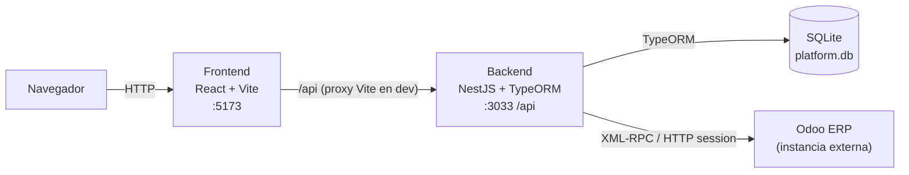

# Odoo Integration Platform

Plataforma full-stack de integración con **Odoo ERP** vía XML-RPC. Permite a equipos de ventas, CRM y administración operar datos de Odoo desde una interfaz web propia, con autenticación independiente, sincronización automática en segundo plano y descarga de documentos PDF.

Desarrollado como proyecto de portafolio sobre un stack moderno: **NestJS + SQLite** en backend y **React + Vite** en frontend.

---

## Arquitectura



**Flujo de datos:**

- El frontend llama a `/api/*` (URL relativa). En desarrollo, Vite proxya esas rutas a `http://localhost:3033`. En producción se requiere un reverse proxy (ver sección [Despliegue](#despliegue)).
- El backend autentica con JWT, consulta SQLite para datos locales, y delega el resto a Odoo vía XML-RPC (`xmlrpc` package). Los PDFs usan un fallback por sesión HTTP porque `/xmlrpc/2/report` está bloqueado en instancias SaaS/trial.
- Un cron interno sincroniza datos de referencia de Odoo (etapas CRM, categorías de productos, departamentos) en la tabla `odoo_cache` cada 5 minutos.

---

## Requisitos

| Requisito | Version minima |
|---|---|
| Node.js | 20 LTS |
| npm | 10+ |
| Instancia Odoo | 16+ (externa, puede ser SaaS/trial) |

No se requiere Docker ni base de datos adicional: SQLite se crea automáticamente en el primer arranque.

---

## Quick Start

### 1. Clonar e instalar dependencias

```bash
git clone https://github.com/Wgutierrezl/odooIntegration.git
cd odooIntegration

cd backend_odoo_integration && npm install
cd ../frontend_odoo_integration && npm install
```

### 2. Configurar variables de entorno del backend

Crear el archivo `backend_odoo_integration/.env` (ver tabla completa en la siguiente sección):

```bash
cp backend_odoo_integration/.env.example backend_odoo_integration/.env
# Editar con los valores reales de tu instancia Odoo
```

### 3. Levantar el backend

```bash
cd backend_odoo_integration
npm run start:dev
# Servidor escuchando en http://localhost:3033
```

> **Importante:** el backend debe correr en el puerto **3033**. Asegurate de tener `PORT=3033` en tu `.env` o de pasarlo como variable de entorno. El valor por defecto del código es 3000, lo que genera una inconsistencia con el proxy del frontend.

### 4. Levantar el frontend

En una segunda terminal:

```bash
cd frontend_odoo_integration
npm run dev
# Interfaz disponible en http://localhost:5173
```

---

## Variables de entorno — Backend

Archivo: `backend_odoo_integration/.env`

| Variable | Descripcion | Requerida | Valor por defecto |
|---|---|---|---|
| `ODOO_URL` | URL base de la instancia Odoo (ej. `https://miempresa.odoo.com`) | Si | — |
| `ODOO_DB` | Nombre de la base de datos Odoo | Si | `''` |
| `ODOO_USERNAME` | Usuario de Odoo para la integración | Si | `''` |
| `ODOO_API_KEY` | API key de Odoo (se usa como password en XML-RPC) | Si | `''` |
| `ODOO_WEB_PASSWORD` | Contraseña web del usuario Odoo (requerida para descarga de PDFs via sesión HTTP) | Si (para PDFs) | `''` |
| `ODOO_TIMEOUT_MS` | Timeout de llamadas XML-RPC en milisegundos | No | `15000` |
| `ODOO_MAX_RETRIES` | Reintentos ante fallo XML-RPC | No | `3` |
| `ODOO_SYNC_INTERVAL_MINUTES` | Intervalo de sync en minutos (parseado pero no aplicado al cron — ver limitaciones) | No | `5` |
| `DATABASE_PATH` | Ruta del archivo SQLite | No | `./data/platform.db` |
| `JWT_SECRET` | Clave secreta para firmar tokens JWT | **Si** (no dejar el default en produccion) | `'default-secret'` |
| `JWT_EXPIRATION` | Tiempo de vida del token JWT | No | `8h` |
| `PORT` | Puerto del servidor HTTP | No | `3000` (usar `3033` para coincidir con el proxy del frontend) |
| `NODE_ENV` | Entorno de ejecucion | No | `development` |
| `FRONTEND_URL` | Origen permitido en CORS | No | `http://localhost:5173` |

> **ODOO_WEB_PASSWORD** no es lo mismo que `ODOO_API_KEY`. La API key se usa para autenticarse via XML-RPC; la web password se usa en el fallback HTTP para generar sesiones web y descargar reportes PDF. Si esta variable no esta configurada, la descarga de PDFs fallara silenciosamente.

---

## Primer arranque — Credenciales semilla

Al iniciar por primera vez, el backend crea automáticamente los siguientes usuarios y roles en SQLite si no existen:

| Email | Contraseña | Rol |
|---|---|---|
| `admin@platform.local` | `Admin123!` | admin |
| `manager@platform.local` | `Manager123!` | manager |
| `seller@platform.local` | `Seller123!` | seller |

> **Cambia estas credenciales inmediatamente.** Son valores de demostración hardcodeados en el seed de la aplicación (`src/database/seeds/initial-seed.ts`). Cualquier persona con acceso al repositorio conoce estas contraseñas. Usá la sección de usuarios de la plataforma para crear cuentas propias con contraseñas seguras y deshabilitar o eliminar las cuentas semilla.

---

## Scripts de desarrollo

### Backend

```bash
npm run start:dev   # Modo watch (desarrollo)
npm run build       # Compilar TypeScript a dist/
npm run start:prod  # Correr el build compilado
npm run test        # Tests unitarios
npm run test:e2e    # Tests end-to-end
```

### Frontend

```bash
npm run dev         # Servidor de desarrollo con hot reload
npm run build       # Build de produccion (output en dist/)
npm run preview     # Previsualizar el build de produccion
npm run lint        # Lint con ESLint
```

---

## API — Resumen de modulos

Base URL: `http://localhost:3033/api`

Todas las rutas (excepto `POST /api/auth/login`) requieren cabecera:

```
Authorization: Bearer <token>
```

| Modulo | Prefijo | Roles | Descripcion |
|---|---|---|---|
| Auth | `/api/auth` | — | Login (`POST /login`), perfil autenticado (`GET /me`) |
| Dashboard | `/api/dashboard` | todos | Resumen de métricas, ventas por periodo, top productos |
| Productos | `/api/products` | todos | Listado de `product.template` desde Odoo |
| Contactos | `/api/contacts` | todos | `res.partner` — clientes, proveedores, todos |
| Ventas | `/api/sales` | todos / manager+ | Pedidos, cotizaciones, confirmar, crear factura, descargar PDFs |
| CRM | `/api/crm` | todos | Oportunidades (`crm.lead`) y actualización de etapas |
| Compras | `/api/purchases` | todos | Pedidos de compra (`purchase.order`) |
| Empleados | `/api/employees` | todos | Empleados (`hr.employee`) |
| Sincronización | `/api/sync` | todos | Estado del último sync, disparo manual (`POST /trigger`) |
| Usuarios | `/api/users` | admin | CRUD de usuarios locales de la plataforma |
| Salud Odoo | `/api/health/odoo` | admin | Estado de conexión con Odoo |

---

## Limitaciones conocidas

| Limitacion | Detalle |
|---|---|
| **XML-RPC restringido en Odoo SaaS** | `/xmlrpc/2/report` y métodos privados como `_render_qweb_pdf` están bloqueados en instancias SaaS/trial. La plataforma implementa un fallback via sesión HTTP para PDFs. |
| **Bug de factura con política `delivered`** | `createInvoice` usa `advance_payment_method=delivered`, que requiere cantidades entregadas en Odoo. Productos sin movimientos de entrega registrados lanzan el error "No se puede crear una factura pues no hay artículos disponibles para facturar". |
| **Proxy solo en desarrollo** | El proxy de Vite (`/api → localhost:3033`) solo funciona con `npm run dev`. El build de producción requiere un reverse proxy externo (nginx) para enrutar `/api`. |
| **`synchronize: true` en TypeORM** | La base de datos se sincroniza automáticamente con las entidades al arrancar. Seguro en desarrollo; peligroso en producción porque puede alterar o eliminar columnas sin migración controlada. |
| **`ODOO_SYNC_INTERVAL_MINUTES` no tiene efecto** | La variable se parsea y registra en config pero el cron está hardcodeado a `EVERY_5_MINUTES` (`@Cron(CronExpression.EVERY_5_MINUTES)`). Cambiarla en `.env` no modifica el intervalo real. |
| **`JWT_SECRET` con valor por defecto inseguro** | Si no se define en `.env`, el sistema usa `'default-secret'` como clave de firma. Cualquier instalación sin esta variable es vulnerable a falsificación de tokens. |
| **Sin cobertura de tests** | Solo existen los tests de scaffold de NestJS. La lógica de negocio, el cliente XML-RPC y los servicios no tienen cobertura. |

---

## Despliegue

No existe Dockerfile, docker-compose ni configuración CI/CD. Los pasos manuales para un despliegue básico son:

### Backend

```bash
cd backend_odoo_integration
npm run build
NODE_ENV=production PORT=3033 JWT_SECRET=<secreto-seguro> \
  ODOO_URL=<url> ODOO_DB=<db> ODOO_USERNAME=<user> \
  ODOO_API_KEY=<key> ODOO_WEB_PASSWORD=<webpass> \
  node dist/main
```

### Frontend

```bash
cd frontend_odoo_integration
npm run build
# El contenido de dist/ se sirve como sitio estático
```

### Reverse proxy (nginx — ejemplo mínimo)

```nginx
server {
    listen 80;
    server_name tu-dominio.com;

    # Frontend estático
    root /var/www/odoo-platform/dist;
    index index.html;

    location / {
        try_files $uri $uri/ /index.html;
    }

    # Proxy al backend
    location /api/ {
        proxy_pass http://127.0.0.1:3033;
        proxy_set_header Host $host;
        proxy_set_header X-Real-IP $remote_addr;
    }
}
```

> Recordá configurar `FRONTEND_URL` en el backend con el dominio real para que CORS funcione correctamente.
